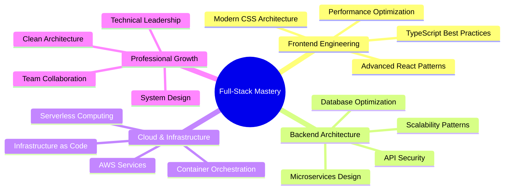

<div align="center">
  
</div>

<div align="center">
  
</div>

<div align="center">
  
</div>

<br>

> "Crafting scalable, high-performance web applications with clean architecture and modern technologies."

## About Me

Senior Full-Stack Developer with 4+ years of professional experience building production-grade applications. Currently at **Vivansh Infotech**, where I architect and deliver robust solutions across the entire technology stack.

**Core Expertise:**
- Full-stack development with React, Next.js, TypeScript, and Node.js
- Backend development with Laravel, Express, and NestJS
- Database design and optimization (MySQL, MongoDB, PostgreSQL)
- Cloud infrastructure and deployment (AWS EC2, S3, Auto Scaling)
- CI/CD pipelines, Docker containerization, and DevOps practices
- RESTful API design and microservices architecture

**Professional Highlights:**
- 4+ years of hands-on development experience delivering production applications
- Strong expertise in modern JavaScript/TypeScript ecosystems
- Proven track record in building scalable, maintainable codebases
- Experience with cloud platforms and automated deployment workflows

## Technical Stack

```typescript
const techStack = {
  frontend: {
    core: ["React.js", "Next.js", "TypeScript", "JavaScript (ES6+)"],
    stateManagement: ["Redux", "Zustand", "React Query", "Context API"],
    styling: ["Tailwind CSS", "Styled Components", "CSS3", "SCSS"],
    ui: ["Responsive Design", "Component Libraries", "Accessibility"],
  },
  
  backend: {
    nodejs: ["Node.js", "Express.js", "NestJS", "Hono.js"],
    php: ["Laravel", "RESTful APIs"],
    databases: ["MySQL", "MongoDB", "PostgreSQL", "Redis"],
    orm: ["Prisma", "Mongoose", "Drizzle", "Eloquent"],
  },
  
  cloudDevOps: {
    aws: ["EC2", "S3", "Auto Scaling Groups", "Lambda"],
    containerization: ["Docker", "Container Orchestration"],
    cicd: ["GitHub Actions", "Jenkins", "Automated Pipelines"],
    deployment: ["Vercel", "AWS Deployment", "Cloudflare Workers"],
  },
  
  toolsAndPractices: {
    versionControl: ["Git", "GitHub", "GitFlow"],
    testing: ["Unit Testing", "Integration Testing", "Test Automation"],
    architecture: ["RESTful API Design", "Microservices", "MVC Pattern"],
    development: ["Agile Methodologies", "Code Review", "Technical Documentation"],
  },
};
```

<div align="center">

### 🛠️ Tech Stack Badges

**Frontend**  


**Backend**  


**Cloud & DevOps**  


**Databases & Tools**  


</div>

## Professional Experience

### Senior Full-Stack Developer
**Vivansh Infotech** | Apr 2021 - Present

Leading full-stack development initiatives and delivering scalable web applications:

**Responsibilities & Achievements:**
- Design and develop full-stack applications using React, Next.js, Node.js, and Laravel
- Architect RESTful APIs and implement efficient database schemas (MySQL, MongoDB, PostgreSQL)
- Build responsive, performant frontend interfaces with modern React patterns and TypeScript
- Deploy and manage production infrastructure on AWS (EC2, S3, Auto Scaling Groups)
- Implement CI/CD pipelines for automated testing and deployment workflows
- Optimize application performance through code splitting, lazy loading, and caching strategies
- Collaborate with cross-functional teams to deliver high-quality software solutions
- Participate in code reviews and maintain coding standards across the team

**Technical Impact:**
- Successfully delivered multiple production applications serving real-world users
- Implemented scalable architectures handling growing traffic and data loads
- Reduced deployment friction through automated CI/CD implementations
- Enhanced code quality and maintainability through TypeScript adoption

## Key Projects & Work

<details>
<summary><b>Enterprise Web Applications</b></summary>

### Full-Stack Applications
**Stack:** React, Next.js, TypeScript, Node.js, Express, Laravel

- Developed end-to-end web applications with modern frontend and robust backend systems
- Implemented authentication, authorization, and role-based access control
- Integrated third-party APIs, payment gateways, and external services
- Built real-time features using WebSockets and event-driven architectures
- Optimized performance for fast load times and smooth user experiences

### Backend & API Development
**Stack:** Node.js, Express, NestJS, Laravel, MySQL, MongoDB

- Designed and implemented RESTful APIs following industry best practices
- Built scalable backend services with proper error handling and validation
- Implemented database optimization techniques for improved query performance
- Created comprehensive API documentation for frontend integration
- Handled data migrations, seeding, and database schema management

### Cloud Infrastructure & Deployment
**Stack:** AWS (EC2, S3, ASG), Docker, CI/CD, GitHub Actions

- Deployed production applications on AWS infrastructure
- Configured auto-scaling groups for handling variable traffic loads
- Containerized applications using Docker for consistent deployments
- Set up automated CI/CD pipelines for streamlined release processes
- Implemented monitoring and logging for production systems

### Frontend Excellence
**Stack:** React, TypeScript, Tailwind CSS, Redux, React Query

- Built responsive, mobile-first user interfaces
- Implemented state management solutions for complex application states
- Optimized rendering performance and reduced bundle sizes
- Created reusable component libraries and design systems
- Ensured cross-browser compatibility and accessibility standards

</details>

## Current Focus & Growth Areas



## Education

**Bachelor of Computer Engineering**  
Gujarat Technological University | June 2018 - June 2022  
CGPA: 8.65 / 10.00 | Mehsana, Gujarat

## 📊 GitHub Stats

<div align="center">
  
  
</div>

<div align="center">
  
  
</div>

## 📝 Latest Blog Posts

<!-- BLOG-POST-LIST:START -->
<!-- BLOG-POST-LIST:END -->

➡️ [Read all posts on my blog](https://www.impruthvi.me/posts)

## Let's Connect

<div align="center">

[](https://impruthvi.me)
[](https://www.linkedin.com/in/pruthvisinh-rajput-9a4711194/)
[](https://twitter.com/impruthvi13)
[](mailto:pruthvirajput97@gmail.com)

</div>

---

<div align="center">
  
</div>

---

<div align="center">
    
*"Building robust, scalable applications with clean code and modern best practices."*
    
📍 Open to collaborations and interesting projects
    
</div>

<div align="center">
  
</div>
