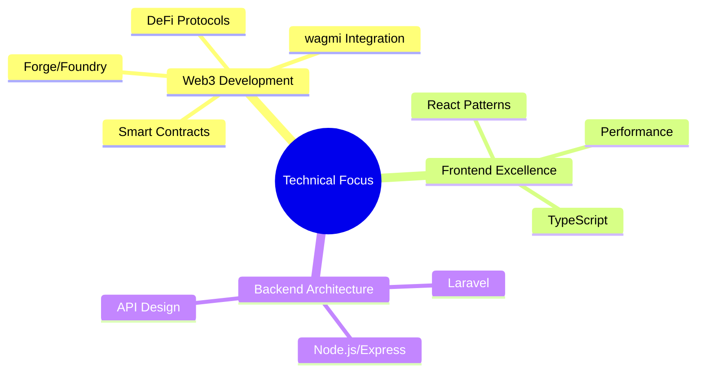

<div align="center">
    <h1>Hello Web3 World! 👋</h1>
    <h3>I'm Pruthvisinh Rajput | Full-Stack & Web3 Developer</h3>
</div>

<div align="center">
    
</div>

> "The best code is the one that's both reliable and maintainable."

## 🧰 About Me

I'm a passionate developer focused on bridging traditional web development with Web3 technologies. I specialize in:

- Building modern web applications with React and TypeScript
- Developing robust backend systems with Node.js and PHP/Laravel
- Creating decentralized applications (dApps) using Solidity and Web3 tools
- Implementing clean, scalable architectures for both Web2 and Web3 projects

## 💻 Technical Stack

```typescript
export const TechStack = {
    web3: {
        smart_contracts: ["Solidity"],
        frameworks: ["wagmi", "viem", "ethers.js", "web3.js"],
        tools: ["Forge", "Foundry"],
        testing: ["Forge Tests", "Fuzzing"],
        protocols: ["ERC20", "ERC721", "ERC1155"],
    },
    frontend: {
        core: ["React", "Next.js", "TypeScript"],
        state: ["Redux", "zustand", "React Query"],
        styling: ["Tailwind CSS", "Styled Components"],
    },
    backend: {
        javascript: ["Node.js", "Express", "NestJS"],
        php: ["Laravel"],
        databases: ["MySQL", "MongoDB", "PostgreSQL"],
    },
    tools: {
        orm: ["Prisma", "Mongoose", "Drizzle"],
        version_control: ["Git", "GitHub"],
        deployment: ["Docker", "AWS", "Vercel"],
    }
} as const;
```

## 🎯 Current Focus Areas



## 📈 GitHub Activity

<div align="center">
    
[](https://github.com/impruthvi)
    
</div>

## 🌟 Featured Projects

<details>
<summary>View Projects</summary>

### 🔗 Web3 Ventures
- Developing smart contracts with Forge/Foundry toolchain
- Building dApps with React, wagmi, and Solidity
- Implementing robust contract testing with Forge
- Creating DeFi protocol integrations
- Gas-optimized contract development

### 🚀 Full-Stack Applications
- Complex React/TypeScript applications
- Scalable Node.js backend systems
- Laravel-based enterprise solutions
- Real-time data processing systems

### 🔧 Development Tools
- Custom React hooks and components
- CLI tools for development workflow
- Reusable smart contract templates
- API integration libraries
</details>

## 🛠️ Recent Web3 Learning Path
- Advanced Smart Contract Development with Forge
- Gas Optimization and Security Best Practices
- Web3 Frontend Integration using wagmi
- DeFi Protocol Architecture
- Foundry Testing and Fuzzing Techniques

## 📫 Let's Connect

<div align="center">

[](https://impruthvi.me)
[](https://www.linkedin.com/in/pruthvi-rajput-9a4711194/)
[](https://twitter.com/impruthvi13)
[](mailto:pruthvirajput97@gmail.com)

</div>

---

<div align="center">
    
*"Building the decentralized future, one commit at a time."*
    
📍 Open to Web3 collaborations and technical discussions
    
</div>
