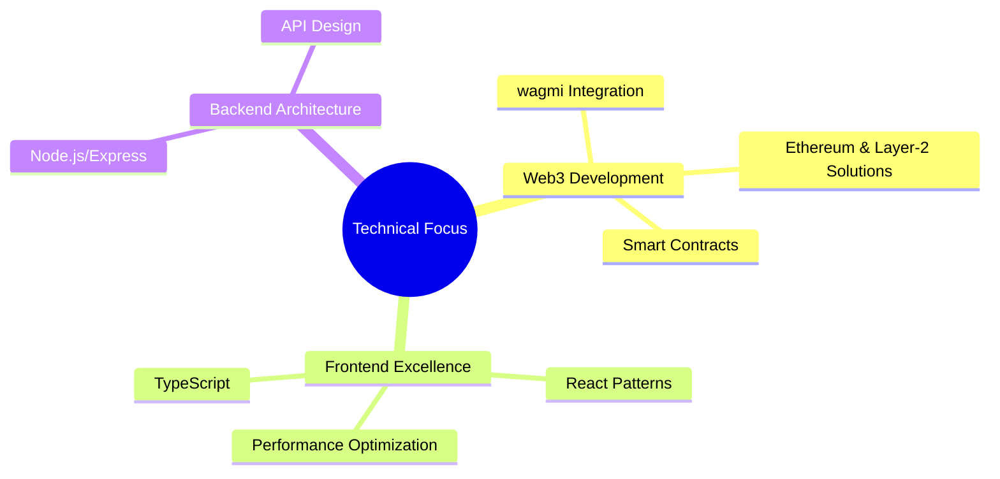

<div align="center">
    <h1>Hello Web3 World! 👋</h1>
    <h3>I'm Pruthvisinh Rajput | Full-Stack & Web3 Developer</h3>
</div>

<div align="center">
    
</div>

> "The best code is the one that's both reliable and maintainable."

## 🧰 About Me

I'm an enthusiastic Full-Stack & Web3 Developer with a growing focus on blockchain technologies. I specialize in:

- Building modern web applications with React and TypeScript
- Developing robust backend systems with Node.js and PHP/Laravel
- Learning and creating decentralized applications (dApps) using Solidity, Web3.js, and Ethereum
- Exploring DeFi protocols and blockchain architectures

I am passionate about bridging traditional web development with emerging Web3 technologies and continually expanding my knowledge in this exciting space.

## 💻 Technical Stack

```typescript
export const TechStack = {
  frontend: {
    core: ["React", "Next.js", "TypeScript"],
    state: ["Redux", "zustand", "React Query"],
    styling: ["Tailwind CSS", "Styled Components"],
  },
  backend: {
    javascript: ["Node.js", "Express", "NestJS", "Hono.js"],
    php: ["Laravel"],
    database: ["MySQL", "MongoDB", "PostgreSQL"],
  },
  web3: {
    smart_contracts: ["Solidity"],
    tools: ["wagmi", "ethers.js", "Forge", "Foundry"],
    testing: ["Forge Tests"],
    protocols: ["ERC20", "ERC721"],
  },
  tools: {
    orm: ["Prisma", "Mongoose", "Drizzle"],
    version_control: ["Git", "GitHub"],
    deployment: ["Docker", "AWS (ASG, S3, EC2)", "Vercel"],
    devops: ["CI/CD", "Kubernetes", "Cloudflare Workers"],
  },
} as const;
```

## 🎯 Current Focus Areas



## 🌟 Featured Projects

<details>
<summary>View Projects</summary>

### 🔗 Web3 Ventures (Learning Phase)

- **Learning Smart Contracts**: Exploring Solidity and developing simple smart contracts.
- **Building dApps**: Learning how to interact with the blockchain using Web3.js and building basic decentralized applications.
- **Exploring Ethereum**: Familiarizing myself with Ethereum-based development and blockchain integration.

### 🚀 Full-Stack Applications

- **React/TypeScript Applications**: Developing full-stack applications with a focus on performance and scalability.
- **Node.js Backend Systems**: Building robust APIs with Node.js and Express.
- **Laravel Solutions**: Developing full-stack solutions using Laravel for the backend.

### 🔧 Development Tools
- **AWS Services**: Working with AWS Auto Scaling Groups (ASG), S3 for storage, EC2 instances for compute.
- **Cloudflare Workers**: Building serverless applications with Cloudflare Workers.
- **CI/CD**: Implementing continuous integration and deployment pipelines with GitHub Actions and Jenkins.
- **Kubernetes**: Familiar with Kubernetes concepts for container orchestration and scaling.


</details>

## 🛠️ Recent Web3 Learning Path

- **Introduction to Smart Contracts with Solidity**
- **Ethereum Blockchain Basics**
- **dApp Development with React and Web3.js**
- **Exploring DeFi Concepts and Protocols**
- **Web3 Frontend Integration using wagmi**

## 📫 Let's Connect

<div align="center">

[](https://impruthvi.me)
[](https://www.linkedin.com/in/pruthvisinh-rajput-9a4711194/)
[](https://twitter.com/impruthvi13)
[](mailto:pruthvirajput97@gmail.com)

</div>

---

<div align="center">
    
*"Building the decentralized future, one commit at a time."*
    
📍 Open to Web3 collaborations and technical discussions
    
</div>
